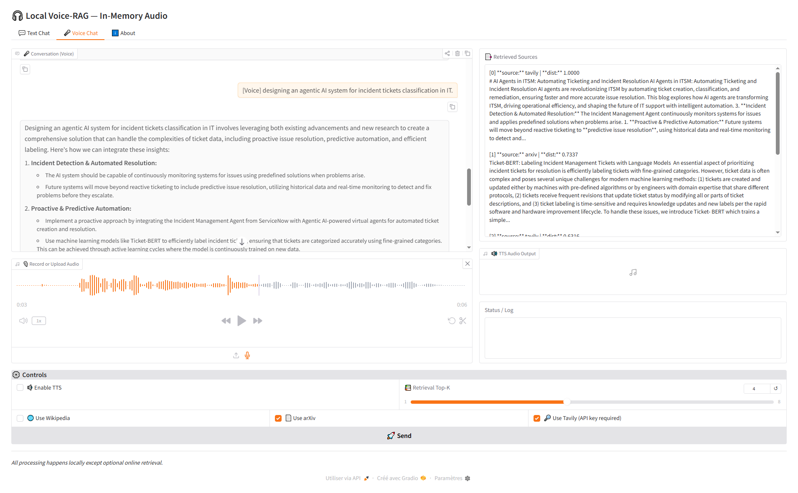

## \# Local Voice-RAG



Local Voice-RAG is a **fully offline Retrieval-Augmented Generation
(RAG) assistant** optimized for CPU, with **optional online web
retrieval** capabilities. It supports:

-   **Text & voice queries**
-   **PDF/TXT indexing**
-   **Semantic search**
-   **Speech-to-Text (STT)**
-   **Text-to-Speech (TTS)**
-   **Web retrievers (Wikipedia, arXiv, Tavily)**
-   **Interactive CLI & Gradio UI**

Powered by:

-   **Ollama** (LLM)
-   **Faster-Whisper** (STT)
-   **Coqui TTS**
-   **ChromaDB** (vector store)

------------------------------------------------------------------------

## Features

### Core

-   Offline **PDF/TXT ingestion** with chunking
-   Local **embedding generation** for semantic search
-   **RAG-augmented answers** using local LLM
-   **TTS & STT support**
-   **CPU-optimized** Gradio UI
-   **Chat history** storage and export

### Web Retrieval (New)

-   Unified **Web Retriever Layer** with:
    -   **Wikipedia search**
    -   **arXiv scientific paper search**
    -   **Tavily** (if API key provided)
-   Automatic fallback between **local RAG** ↔ **web search**
-   Configurable priority and toggles in `config.py`
-   Included in both **CLI** and **UI** workflows

### New

-   Interactive **CLI REPL**
    -   Multiline input (`:ml` or `Ctrl+J`)
    -   Audio recording (`record` or `Ctrl+R`)
    -   TTS toggle (`speakon` / `speakoff`)
    -   File-based audio queries (`file <wav|mp3>`)
-   **Incremental indexing**: only index new documents
-   **Hybrid UI + CLI mode**

------------------------------------------------------------------------

## Installation

### 1. Clone the repository

``` bash
git clone https://github.com/yourusername/voice-rag.git
cd voice-rag
```

### 2. Create Python environment

**Recommended (Conda)**

``` bash
conda create -n voicerag python=3.10 -y
conda activate voicerag
```

**Or Python venv**

``` bash
python -m venv venv
source venv/bin/activate     # Linux/macOS
venv\Scripts\activate       # Windows
```

### 3. Install dependencies

``` bash
pip install -r requirements.txt
```

Optional (if not included in `requirements.txt`):

``` bash
pip install faster-whisper chromadb sentence-transformers TTS pypdf pymupdf gradio
```

Ensure **Ollama** is installed and running:

``` bash
ollama serve
ollama pull qwen2.5:3b
```

------------------------------------------------------------------------

## Configuration

All configuration lives in `voice_rag/config.py`. Example:

``` python
CONFIG = {
    "whisper_model": "small",
    "embedding_model": "voice_rag/bge-small-en",
    "chroma_dir": "voice_rag/chroma_db",
    "cross_encoder": "cross-encoder/ms-marco-MiniLM-L-6-v2",
    "ollama_http": "http://localhost:11434",
    "ollama_model": "qwen2.5:3b",
    "coqui_model": "tts_models/en/ljspeech/fast_pitch",
    "record_seconds_default": 15,
    "sample_rate": 16000,
    "mic_channels": 1,
    "output_dir": "output",

    "enable_web": True,
    "wiki_enabled": True,
    "arxiv_enabled": True,
    "tavily_enabled": False,
}
```

------------------------------------------------------------------------

## Usage

Run the main entrypoint:

``` bash
python run.py [options]
```

### 1. Build or rebuild index

``` bash
python run.py --reindex
```

### 2. Index specific PDFs

``` bash
python run.py --pdfs doc1.pdf doc2.pdf --reindex
```

### 3. Launch Gradio UI

``` bash
python run.py --ui
```

Visit: http://127.0.0.1:7861

### 4. Interactive CLI Chat

``` bash
python run.py --chat
```

#### Commands

Command                  Description
  ------------------------ --------------------------------
`record`                 Record audio → STT → RAG → LLM
`file <path>`            Use an audio file as query
`speakon` / `speakoff`   Enable/disable TTS
`:ml`                    Multiline input
`exit` / `quit`          Exit REPL

#### Hotkeys

Hotkey   Action
  -------- -----------------
Ctrl+J   Multiline query
Ctrl+R   Record audio

### 5. Hybrid Mode (UI + CLI)

``` bash
python run.py --ui --chat
```

------------------------------------------------------------------------

## System Flow

``` mermaid
flowchart TD
    A[User Input] -->|Text| B[Text Handler]
    A -->|Voice| C[Voice Handler STT]
    B --> D[RAG Agent]
    C --> D

    D --> M{Web Retrieval Enabled?}
    M -->|Yes| W[Web Retriever<br>(Wikipedia / arXiv / Tavily)]
    M -->|No| E[Local Retrieval]

    W --> E[Context Retrieval]

    E --> F[LLM Ollama]
    F --> G[Answer Generation]

    G --> H{TTS Enabled?}
    H -->|Yes| I[Coqui TTS]
    H -->|No| J[Text Response]

    I --> J
    J --> K[Display in UI or CLI]
    K --> L[Chat History Storage]
```

------------------------------------------------------------------------

## Chat History

Stored in `output/chat_history.json`.

------------------------------------------------------------------------

## Folder Structure

    voice-rag/
    ├── run.py
    ├── requirements.txt
    ├── LICENSE
    ├── README.md
    └── voice_rag/
        ├── agent.py
        ├── agent_helpers.py
        ├── cli.py
        ├── config.py
        ├── embeddings.py
        ├── history.py
        ├── hotkeys.py
        ├── pdf_loader.py
        ├── reranker.py
        ├── stt.py
        ├── tts.py
        ├── ui.py
        ├── utils.py
        └── web_retreivers.py

------------------------------------------------------------------------

## License

MIT License

